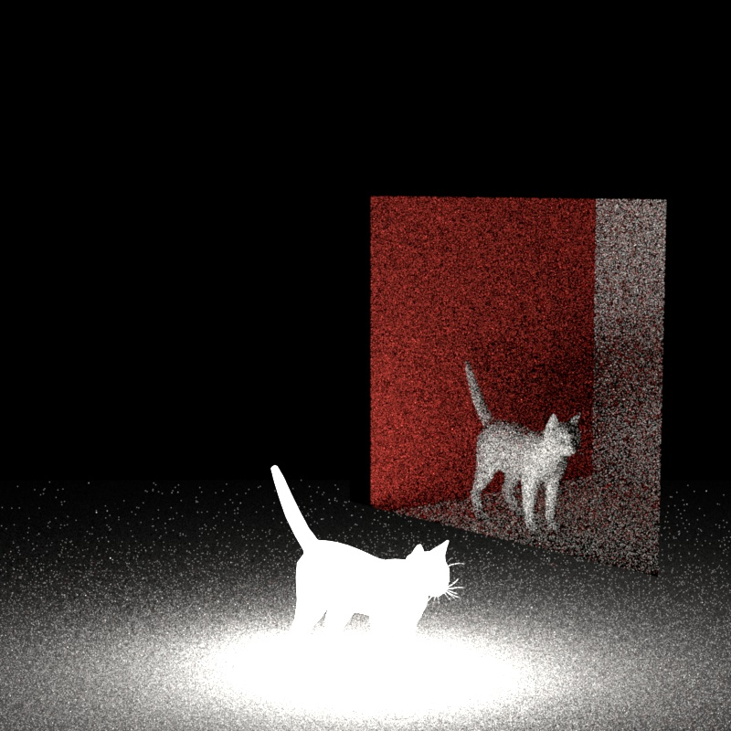

# CG22 final project - Quentin Guignard

<!DOCTYPE html PUBLIC '-//W3C//DTD XHTML 1.0 Transitional//EN' 'http://www.w3.org/TR/xhtml1/DTD/xhtml1-transitional.dtd'>
<head>
    <meta charset="utf-8">
    <meta http-equiv="X-UA-Compatible" content="IE=edge">
    <meta name="viewport" content="width=device-width, initial-scale=1">
    <link href="resources/twentytwenty.css" rel="stylesheet" type="text/css" />
</head>


<br/><br/>
<br/><br/>
<p style="text-align:center;"><figcaption style="text-align:center;">Final rendered image</figcaption></p>
<br/><br/>
<br/><br/>

This is the report for the Computer Graphics 22 course at ETH. The goal of the project was to implement a full path tracer with some precisely chosen features. The features are listed bellow in the subject table. Each section consists of the description of the task as well as a showcase of the renderer concerning the current feature. Therefore, in each section we will explain how we implemented and designed the feature and we will also provide a side to side comparision with the [Mitsuba renderer](https://mitsuba.readthedocs.io/en/stable/) for validation purpose. When all features were implememented, we made a final scene which aimed to demonstrate our work. We will begin this discussion by covering Texture mapping and we'll follow the order in the subject list bellow.


- [Texture-mapping](#texture-mapping)
- [**Depth-of-field**](#depth-of-field)
- [**Textured-emitter**](#textured-emitter)
- [**My own mesh**](#my-own-mesh)
- [**Using the Open Intel denoiser**](#using-the-open-intel-denoiser)
- [**Normal mapping**](#normal-mapping)
- [**Environment map**](#environment-map)
- [**Homogeneous participating media**](#homogeneous-participating-media)
- [**Final project**](#final-project)
  - [Basic raytraced Portals](#basic-raytraced-portals)
  - [The final scene](#the-final-scene)
  - [Conclusion](#conclusion)
- [Resources](#resources)

<br/><br/>
<br/><br/>


# Texture-mapping

For this part we modified the following files:
- include/image.h

In this section, we'll cover the texture mapping. Texture mapping allow to map a texture on a mesh using UV coordinates. In this project we are loading "obj" models. These models contains vertices, UV coordinates as well as normals for every vertex. Every time a ray intersects with a triangle, we use the barycentric coordinates of the three triangle vertices in order to find the interpolated UV coordinates at the intersection point. Then, we simply lookup the texture pixel array at this precise UV coordinates. This is done by converting the UV coordinates which are both in the range $[0, 1]$ to the $[0,w]*[0,h]$. range. The we simply lookup the $[R,G,B]$ vector stored in the texture at this UV location. We used a very simple strategy for the UV mapping which is commonly refered to as the "nearest hit". This means that we simply multiply the width by U and the height by V to get the pixel location to sample. 

$$UV_{array}=UV_{[0,1]}*(w-1, h-1)$$

Another important aspect of loading a texture and wanted to display it is to perform and gamma correction inverse. Following the sRGB standard, we need to restore a linear relationship between the brightness of the pixel and its values. We used the following piece of code from the [PBR book](https://www.pbr-book.org/3ed-2018/Texture/Image_Texture#InverseGammaCorrect).

```
inline Float InverseGammaCorrect(Float value) {
    if (value <= 0.04045f)
        return value * 1.f / 12.92f;
    return std::pow((value + 0.055f) * 1.f / 1.055f, (Float)2.4f);
}
``` 

When writing back an image to disk, we would rather perform the opposite operation which also was found in the [PBR book](https://www.pbr-book.org/3ed-2018/Texture/Image_Texture#GammaCorrect):

```
inline Float GammaCorrect(Float value) {
    if (value <= 0.0031308f)
        return 12.92f * value;
    return 1.055f * std::pow(value, (Float)(1.f / 2.4f)) - 0.055f;
}
```

This gamma correction is required as computer displays do not have a linear relationship between the pixel values and the brightness they emit. Therefore, without the correction, the resulting image in our renderer would appear darker and with less vibe than they should be.

You will find bellow a side-to-side comparision rendered between our renderer using our `path_mis` and Mitsuba. Note that mitsuba is using bilinear filtering as texture sampling strategy which decrease artifacts when a UV sampling event do not land exactly in the center of a pixel and when the texture has a low quality (here it is the case). We still observe that the textures are mapped correctly and that the colors looked the same on both images. We'll now move on to the Depth of field part.

<br/><br/>
<br/><br/>

<div class="twentytwenty-container">
        
        
</div> <figcaption style="text-align:center;">Side to side comparision of the texture scene between Nori and Mitsuba</figcaption><br>

<br/><br/>
<br/><br/>

# **Depth-of-field**

For this part we modified the following files:
- persepective.cpp

Depth of field is the distance between the closest and the farest object in focus. Any object located at some other distance would appears out of focus to some extend. We parametrized our depth of field using 2 parameters following the same idea as in the [Pbr book](https://www.pbr-book.org/3ed-2018/Camera_Models/Realistic_Cameras). We defined our depth of field by:

1. an aperture size: the radius of the hole from which the light enters the camera.
2. the focal length: this indicates where the rays converge for the camera.

The intuitive explanation of depth of field is as follows. We can imagine a focal plane in front of the camera. This focal plane is in fact a sphere that contains the camera with a radius equal to the focal length. Any object that is not on this focal plane will appears out of focus. In order to simulate this out of focus effect we incorporated (again following the idea in the book) the following piece of code in our camera `sampleRay` method:

```
if (m_appertureRadius > 0.0f) {
    Point2f pLens = m_appertureRadius * Warp::squareToUniformDisk(apertureSample);
    float ft = m_focalDistance / ray.d.z();
    Point3f focusPoint = ray.d * ft;
    ray.o = Point3f(pLens.x(), pLens.y(), 0);
    ray.d = (focusPoint - ray.o).normalized();
}
```

We first sample a location on the apperture lens. We compute the new displaced ray origin (landing on the sensor) and we recompute the new direction of the ray toward the focus point. After that we simply converted the ray origin and direction in world coordinates. An example of depth of field with a side-to-side comparision can be observed bellow. The parameters where as follows in both Nori and Mitsuba (rendered using `path_mis`).

- aperture radius = 0.2 [scene units]
- focal length = 6 [scene units]

<div class="twentytwenty-container">
        
        
</div> <figcaption style="text-align:center;">Side to side comparision of the depth of field scene between Nori and Mitsuba</figcaption><br>


<br/><br/>
<br/><br/>

# **Textured-emitter**

Files modified:
- arealight.cpp
- all integrators

In this section we will detail our implementation of textured emitter. The idea of a texture emitter is to have some texture sampling on top of an area light. This means that when sampling or evaluating the radiance of an area light, we will sample the texture at the sample location of the area light mesh in order to get the radiance. The texture sampling works exactly as described in the texture section. When sampling an area emitter we first sample a mesh. From this sampling event we get an point on the mesh as well as a direction from the point we are sampling the emitter. We then simply build a ray starting from the reference sampling position and pointing toward the sampling direction. We then use the scene to check for an intersection with the emitter mesh to get the $UV$ coordinates and we can evaluate the texture at these coordinates in order to get the radiance. It is worth to note that we added a 3-dimentional vector called "strength" to the area light. This parameters gets multiplied by the radiance we get from the texture. Indeed, the values in the textures are (for PNGs at least) in the range $[0, 1]$ and thus produces only very dim results. Therefore, mulitpling the texture obtained radiance by some user controlled parameter helped to get brighter results. It is worth to note that when intersecting directly the emitter we also need to provide the intersection point $UV$ coordinates in order to evaluate correctly the texture.

We can observe bellow a side-to-side comparision with Mitsuba. We see that the results look very close noise appart. The brightness is the same (tested with tev) and the error is very small (again mostly noise). We can now continue our discussion with the shape modelling process.

<br/><br/>
<br/><br/>

<div class="twentytwenty-container">
        
        
</div> <figcaption style="text-align:center;">Side to side comparision of the textured emitter scene between Nori and Mitsuba</figcaption><br>


<br/><br/>
<br/><br/>

# **My own mesh**

This part is about the mesh modelling process and it was really fun! As seen in our introduction we wanted to model butterflies. We found a [blender tutorial](https://www.youtube.com/watch?v=e4jqiZO_BqU) on youtube by PIXXO 3D. We can observe bellow two images. The first one of the modelling process and the second one as the green morpho starting image.


<br/><br/>
<br/><br/>
<p style="text-align:center;"><figcaption style="text-align:center;">Blender screenshot showing the modelling process</figcaption></p>
<br/><br/>
<br/><br/>


<br/><br/>
<br/><br/>
<p style="text-align:center;"><figcaption style="text-align:center;">The starting pattern for the green morpho</figcaption></p>
<br/><br/>
<br/><br/>


The idea is to use a real butterfly image to model the mesh. We start from a 2D view of the butterfly and place vertices around the wings and the body. We then extrude and move around the body parts a bit in order to get a better pose. We finally mapped the texture by projecting the image on our 3D model. We then exported our model as an obj and were able to import it in our renderer. You can observe an example of the model in our renderer in the next section where we'll show our use of the Intel denoiser.


<br/><br/>
<br/><br/>

# **Using the Open Intel denoiser**

Files modified:
- main.cpp
- renderThread.cpp
- NoriScreen.cpp
- integrator.h and integrator.cpp

In this section we'll describe how we incorporated the [Intel Open Image denoiser](https://www.openimagedenoise.org/) in our project but first we'll describe very quickly why it is a great tool. As you could observe in prevous side to side comparision, some noise is present on most of our images. This noise appears because we are non-deterministically sampling light sources. We used a "mis" stragegy over our Monte-Carlo based path tracer, this stragegy imply that at each intersection point we randomly sample and emitter and we also sample the BSDF of the current intersection point from which we get an idea of how light interacted with the object. This means that we get the color seen from the ray from the intersection point as well as an outgoing direction in order to continue the tracing process. In simple terms, we have two sampling events, one for a light source and another one for the material. Both these events are non-deterministic and therefore might not get uniform and consitent results everywhere. Therefore, some pixels very near pixels might not capture the same amount of light and this could introduce noise. Normally, the image should be converging to a lesser noisy image when running the path tracer. However, this might take a long time. Nori went with some camera reconstruction filters with a Gaussian filter by default. This filter already aim to reduce this noise effect but is not perfect. This is why we decided to use the Intel denoise. Bellow you can find the result of denoising a scene.

<br/><br/>
<br/><br/>
<div class="twentytwenty-container">
        
        
</div> <figcaption style="text-align:center;">Side to side comparision of the noisy and denoised image in Nori</figcaption><br>
<br/><br/>
<br/><br/>

The intel denoiser is based on neural networks and will "polish" our image from all the noise it contains. In order to include it we simply downloaded the pre-built binaries and modified the CMakeList to link the library with Nori. Then we simply copy pasted the example code fromt the documentation of the tool and it worked quite nicely. The piece of code to execute the denoiser is as follows:

```
oidn::FilterRef filter = device.newFilter("RT");
filter.setImage("color",  color.data(),  oidn::Format::Float3, width, height);
filter.setImage("albedo",  albedo.data(),  oidn::Format::Float3, width, height);
filter.setImage("normal",  normal.data(),  oidn::Format::Float3, width, height);
filter.setImage("output",  output.data(),  oidn::Format::Float3, width, height);
filter.set("cleanAux", true);
filter.commit();
filter.execute(); 
```

As you can observe, we are feeding the denoise with the `color` buffer which contains our noisy image. We also give it both an `albedo` and a `normal` buffer. We haven't been running deep tests but providing these optional buffers increased the quality of the denoising. You can observe bellow how the albedo and the normal (mapped to the range $[0,1]$ for displaying purposes) buffers looked.

<br/><br/>
<br/><br/>
<div class="twentytwenty-container">
        
        
</div><figcaption style="text-align:center;">Side to side comparision of both the albedo and normals (in range [0,1]) buffers</figcaption><br>
<br/><br/>
<br/><br/>

In order to implement this feature we had to modify the rendering code so that it would start three rendering threads at the start of the program. One default thread that will compute the image and two others that would compute the albedo and the normals. We incroporated two special Li functions in the abstract integrator that would allow to overide the default Li method when rendering depending on if we want to get the albedo or the normals. In overall the only difficulties occured when messing up with the Nori rendering code but appart from that everything wrapped up very quickly. With that said we can now move on to the normal mapping part.


<br/><br/>
<br/><br/>

# **Normal mapping**

Files modified:
- normal_map.h
- shape.cpp
- mesh.cpp
- sphere.cpp

In this section we will discuss how we implemented normal mapping. We had a look to Mitsuba source code and we noticed Mitsuba is adding the normal mapping at the shape level. We decided to do the same as when the mesh normals are modified, all the shading in the integrator and other BSDFs can be let as is and still be influenced by the normal map.

The idea was very simple. When and intersection is happening with a triangle, the Mesh class will set the hit informations in some struct. Among other things, the $UV$ coordinates and the normal are set in the struct. We therefore added a Normal map texture to the shape. This special type of texture returns normal vectors and take care of remapping the normals in the range $[-1, 1]^{3}$ when they are queried from the RGB texture in range $[0,1]^{3}$. Then, in the mesh `setHitInformation` function we check if there is a normal map texture attached to the current mesh. If there is one we create a frame with the default normal that is interpolated between the three normals of each triangle vertex using barycentric coordinates. We then evaluate the normal map using the $UV$ at the intersection location. The normal we get from the normal map texture is in local coordinates and the normal we want to return from the hit event is in world coordinates. Therefore, we use the frame created with the default normal to transform the normal mapped normal to world coordinates (of the default normal). This is the only modification we had to perform in order to get normal map support in our renderer. Then whenever the shading frame is used the normal from the normal map in world coordinates is used and visual details appears. You will find bellow a side-to-side comparision with Mitsuba. The results are again very close noise appart. The BSDF used for the ground is a mirror in our path tracer and is an Aluminium conductor for the Mitsuba renderer as there was no mirror available. Note that this could introduce a bias when comparing. Otherwise the backwall is using in both cases a diffuse BSDF with a brick normal map.

<br/><br/>
<br/><br/>
<div class="twentytwenty-container">
        
        
</div> <figcaption style="text-align:center;">Side to side comparision of the normal mapping scene between Nori and Mitsuba</figcaption><br>
<br/><br/>
<br/><br/>

# **Environment map**

Files modifies:
- environment_light.h and environment_light.cpp
- coordinates.h

In this section we will discuss our implementation of the environment map. We based ourselves on the paper [Monte Carlo Rendering with Natural Illumination](http://web.cs.wpi.edu/~emmanuel/courses/cs563/S07/projects/envsample.pdf). In a first step we will briefly describe what environment mapping. In a second step we will describe the process of importance sampling and lastly we will showcase our results against Mitsuba.

Environment mapping is a technique to generate global lightning in the scene. We could think about it as ambiante lightning but with an image and by sampling along specific enlit part of the world. The idea is to have (in our case) a spherical mapped image. This image is mapped as if it was displayed on a sphere. You can observe an example of an enviroment map on Figure 1 bellow. When proceeding our path tracing in the scene we simply imagine that an infinite sphere surrounds our scene. Therefore, when a ray is leaving our scene and it intersects nothing we simply convert our ray direction. Firstly, we convert from cartesian to spherical coordinates and secondly we convert these spherical coordinates into UV coordinates and we sample the texure. At this point we simply see the texture around our scene and if using our `path_mat` we also see a few of the environment map lightning reflecting on our objects. However, the best part of environment map display comes with our `path_mis` implementation as now we may sample the environment map emitter. We will describe this process in the next paragraph.

In order to sample the environment map we need to implement importance sampling. Our goal is to get most of the environment map ligthning in our scene and thus we want to sample the areas with the largest luminance. [Monte Carlo Rendering with Natural Illumination](http://web.cs.wpi.edu/~emmanuel/courses/cs563/S07/projects/envsample.pdf) shows a method where we compute probability densities along both axis of the environment map image. We use the vertical axis U from top to bottom and the horizontal axis V from left to right as conventions for this project. The idea is to first compute the Pdf and the Cdf along the U axis (meaning we get a 1D array of height). After that, we compute the conditional Pdf and Cdf along the V axis from which we get a 2D array with the same dimension of the image. We can observe the image representation of the densities for the image in Figure 1 in Figure 5, 6, 7, and 8. In order to compute the densities we start from the luminance map as shown in Figure 2. Note that the paper advised us to multiply the luminance by $sin(\theta)$ in order to convert to solid angle unit. We will now quickly explain how the computation of the densities was done.  


<br/><br/>
<br/><br/>
<table>
  <tr>
    <td>
    <figcaption>Fig.1 - base image</figcaption></td>
    <td>
    <figcaption>Fig.2 - luminance</figcaption></td></td>
   </tr> 
   <tr>
      <td> 
      <figcaption>Fig.3 - 100 samples 1D</figcaption></td></td>
        <td>
        <figcaption>Fig.4 - 100 samples 2D</figcaption></td></td>
  </td>
  </tr>
</table>

<br/><br/>
<br/><br/>

As described in the last paragraph we begin with the luminance of the image. In a first step we compute the 1D $p(u)$ and $P(u)$ and in a second step we compute the 2D conditional densities as $p(v|u)$ and $P(v|u)$. In order to compute a 1D density from the columns of the same row of an image we first compute the pdf as shown in the paper for the function "precompute1D". Therefore, we sum all the column values of the same row as $sum_{i}$. Then, the probability at index $i$ is given by $p[i]=\frac{luminance_{i}}{sum_{i}}$. Next, in order to compute the cdf we simply accumulate the pdf for each index as $Cdf[i]=Cdf[i-1]+p[i-1]$ and taking care that $Cdf[0]=0$ and $Cdf[last]=1$. In order to compute the densities for $U_{1D}$ and $V_{2D}$ we can look at the function "precompute2D" in the paper. We first compute the pdf and Cdf for every rows of $V_{2D}$ (we look at the columns) and for each row we accumulate a sum of the columns of that row. At then end we compute the densities for $U_{1D}$ from this columns sum that is called "colsum" in the paper. We can observe $p(u)$ on Figure 5 as well as $P(u)$ on Figure 6. We first note that the 1D array was extended to a 2D picture for display purposes. A whiter line imply a greater value. Remember that U is the vertical axis from top to bottom and observe that for $p(u)$ the lines are very white around the level of the windows seen in the base image on Figure 1. This follows our intuition that the brighter rows are around this level of the image. If we look at $P(u)$ on Figure 6 we see that the top is black, namely $P(U=0)=0$ but that from the level of the windows the cdf increases and stabilised itself bellow the height of the window in Figure 1. This again follows our intuition that the brightest pixels are among the rows near the windows. If we now have a look at $p(v|u)$ on Figure 7. We see that the only bright areas are clearly defined around the windows and the lights at the ceiling. This again converges to the fact that for a given row, the brightest column must be near a window as well. This observation is repeated in Figure 8 depicting $P(v|u)$. Keep in mind that the Cdf is accumulated for each row along that row. This mean that as we can observe the lowest $P(v|u)$ values are in the left side of the image. Moreover, we note that there is a steep increase in brightness again at the level of the left windows. After that there is a flat area with no lightning and finally a new increase when we reach the far right of the near the right window. All these experiments tended to show that our computation of the densities are correct since they match our expectation. We can now move on to the sampling part.

In this paragraph, we will describe the important sampling process. As said before, we want to sample the environment map where it yields the most lightning information. Put differently, we want to sample the environment map where the luminance is the highest. The idea of sampling is to get a coordinates pair $(u,v)$ such that the luminance in the environment map at this location yields a good overview of the overall lightning in the scene. Therefore, in order to choose this location we first sample along U and get $(u, p(u))$. Then we use the row index $u$ to sample among the columns and get $v$ as $(v,p(v|u))$. Now we simply can compute the joined probalility density as $p(u,v)=p(v|u)*p(u)$ and return the pair $((u,v), p(u,v))$ from the sampling event. We can observe some sampling experiments we made on Figures 3 and 4. On Figure 3 we drawn 100 samples from the U distribution. We can see that the samples are located near the window regions which is what we would expects as these regions are the brightest. On Figure 4, we drawn 100 2D samples. While some samples where located at some dimmer places, most of them landed on the windows itself showing that our importance sampling is working in the right direction. In fac, we did not had any other way to check for correctness concerning the importance sampling part. However, we compared with Mitsuba in the next paragraph.


<br/><br/>
<br/><br/>

<table>
  <tr>
    <td>
    <figcaption>Fig.5 - pdf U</figcaption></td>
    <td>
    <figcaption>Fig.6 - cdf U</figcaption></td></td>
   </tr> 
   <tr>
      <td> 
      <figcaption>Fig.7 - pdf V</figcaption></td></td>
        <td>
        <figcaption>Fig.8 - cdf V</figcaption></td></td>
  </td>
  </tr>
</table>

<br/><br/>
<br/><br/>

In this last paragraph, we will wrap up the envrionment sampling process in Nori and we will compare our results with Mitsuba. Indeed, we did not described what the `EnvrionmentEmitter` class really do upon a sampling event. In fact, we perform the sampling as explained above. We get $((u,v), p(u,v))$. We convert $(u,v)$ in spherical coordinates and then in cartesian coordinates which gives us $w_i$. We then compute the pdf converted to the right units as $p(w)=p(u,v)\frac{n_{u}n_{v}}{2\pi\sin(\theta)}$ and we return the result. We can observe bellow two side-to-side comparisions with Mitsuba. Keep in mind that we did not interpolated the pixels when sampling our environment texture so our results are looking blockier than Mitsuba. However, we see that they almost perfectly match. In the first image the shadows are a bit dimmer in our case and in the second image the Ajaxes are a bit brighter in Mitsuba case but in overall the shape of the shadows and the scene mood is very close. We now will move on to the homogeneous media section.

<br/><br/>
<br/><br/>

<div class="twentytwenty-container">
        
        
</div> <figcaption style="text-align:center;">Side to side comparision of the first environment map scene using a garden texture between Nori and Mitsuba</figcaption><br>

<div class="twentytwenty-container">
        
        
</div> <figcaption style="text-align:center;">Side to side comparision of the first environment map scene using a moon scene texture between Nori and Mitsuba</figcaption><br>
<br/><br/>
<br/><br/>

# **Homogeneous participating media** 

Files modified:
- vol_path_mis.cpp
- vol_path_mats.cpp
- medium.h and medium.cpp
- warp.h and warp.cpp

In this section we will describe how we implemented our volumetric mis path tracer. We will first explain the concept of homogeneous media. After that we'll briefly describe our algorithm by showing pseudo code. Then will discuss the implementation of the medium. Lastly, we will show a comparision with Mitsuba.

An participating media is a partially opac dielectric substance interacting with light. For example water is translucide to some extend but interact with light. This means that the radiance is absorbed by the media as a light ray make its way through its volume. In overall, a participating media is formed by a volume in which light is redirected in multiple directions. Each time a redirection happens the radiance is getting absorbed. This absorption is described by the Beer's Law. With that said, we will now descibe our implementation.

Our algorithm is based on the slides but we abstracted ourselves from it and tried to reason logically about what the path tracer should do. In fact we went with a two mode path tracer. A "media" mode and a "normal" mode. In the media mode, we are deciding if we are performing a media interaction in a mean-free path or if we are performing a surface interaction. For example, if an object is present in the media, we may have a BSDF sampling event on the surface of the object while staying in media mode. It is also possible for the medium to have a bsdf on its surface and if it is the case we could have a surface interaction. In this special case the result of the surface interaction could lead to an outgoing direction going back in the media. For exemple, this could happens if the media has a dielectric BSDF as the ray can be either reflected or refracted depending of the fresnel coefficient. Finally, the normal mode consists of our basic mis path tracer. At every intersection point we look whether we are entering a media or not and modify the state as required. The pseudo code of function `Li` goes as follows:

```
while True:
    intersection, hasIntersected = traceRay()
    if (mode == normal):
        mis = evalMis()
        if (intersection.medium == None):
            if (not hasIntersected):
                sampleEnvironment()
                return
            updateState()
        else:
            if (BSDF.isvisible):
                mediaSurfaceInteraction()
            checkRayEnteringMedia()
            updateState()
    elif (mdoe == media):
        medium = evalMedium()
        if (intersection.medium == None):
            surfaceInteraction()
        else:
            mis = evalMis()
            if (BSDF.isvisible):
                mediaSurfaceInteraction()
            checkRayEnteringMedia()
            updateState()
    update_t()
```

The code of `evalMis` is the same as in the basic Mis path tracer. Here is the pseudo code of the `evalMedium` pseudo code adpated from the slides of the course.

```
tmax := dist(ray.o, itersection.p)
tSampled := medium.infCdf(random())
if (tSampled < tMax): 
    # media event
    mediaSample := medium.sample(random2D())
    updateResult()
else: 
    # surface interaction inside media
    mis = evalMis()
    updateResult()
```

Now that we have showed the design of our integrator we will discuss the sampling of the medium. During a medium interaction, we are sampling the medium given a specific phase function. We implemented two such functions. The first one is the isotropic phase function. This is simply sampling the new media direction along a sphere as we did during the Warp assignment. The other phase function we implemented is the [Henyey-Greenstein](https://fr.wikipedia.org/wiki/Fonction_de_phase_de_Henyey-Greenstein) sampler. Its probability density function is defined as $p(\cos(\theta))=\frac{1}{4\pi}\frac{1-g^{2}}{(1+g^{2}-2g\cos(\theta))^{\frac{3}{2}}}$. In order to sample a 3D direction using Henyey-Greenstein we based ourselves on the method we used in the warp assignment when we mapped a square distribution with parameters $(\eta, \sigma)$ to a spherical direction $(\theta, \phi)$. We used the results from the slides to compute $\cos\theta=\frac{1}{2g}(1+g^{2}-(\frac{1-g^{2}}{1-g+2g\eta}))$ and $\phi=2\pi\sigma$. You can observe some warping tests on Figure 1, 2 and 3. On Figure 1 we see the Henyey-Greenstein and on figure 2 we can see the unit sphere sampling for comparision. Note that for the Henyey-Greenstein, the intensity is not taken into account so we do not see a difference in distance to the origin for each sample. Lastly, we can observe the Chi square test for the Henyey-Greenstein function on Figure 3. We will now move on to the comparision part in next paragraph.

<br/><br/>
<br/><br/>

<table>
  <tr>
    <td>
    <figcaption>Fig.1 Henyey-Greenstein phase function</figcaption></td>
    <td>
    <figcaption>Fig.2 unit sphere</figcaption></td></td>
   </tr> 
   <tr>
      <td> 
      <figcaption>Fig.3 warp test of Henyey-Greenstein</figcaption></td></td>
  </td>
  </tr>
</table>

<br/><br/>
<br/><br/>

Bellow, we can observe two side by side comparisions with Mitsuba. In the first comparision we used the isotropic phase function and in the second we used the Henyey-Greenstein phase function. In the latter case, each block has a different $g$ parameter. From left to right we have $g_{1}=0.1$, $g_{2}=0.5$, $g_{3}=0.7$. Moreover, for both scenes $\sigma_t=(1,1,1)$ and $\sigma_s=(1,1,1)$. Concerning both results we can see that for 64 spp our rendered images are way noisier than Mitsuba. More precisely, the isotropic comparision looks very similar to Mitsuba noise appart. However, for the Henyey-Greenstein case we can observe that the boundaries of the mediums are less pronounced with our version than with Mitsuba. We don't know exactly what is the cause of such artifact but late in the project we discovered a flaw in our code. It is possible that the context medium is incorrect when having multiple medias in the same scene. But it is only an hypothesis about the cause of the artifact. This small analysis concludes this section and we now move on to the last part with the final project creation.

<br/><br/>
<br/><br/>

<div class="twentytwenty-container">
        
        
</div> <figcaption style="text-align:center;">Side to side comparision of the homogenenous media scene using isotropic sampling</figcaption><br>
<br/><br/>
<br/><br/>
<div class="twentytwenty-container">
        
        
</div> <figcaption style="text-align:center;">Side to side comparision of the homogenenous media scene using Henyey-Greenstein sampling</figcaption><br>

# **Final project**

In this final section, in a first step, I will explain why I created the image as it is and I'll desribed our thought process. In a second step, I'll show how I built the scene using our renderer as well as how I modelled the scene itself.

I did not know much about raytracing before taking this course. I had a small introduction during my bachelor studies but it was kept simple. I discovered that raytracing is a beautiful tool. Similarly to a pencil it allows to make sureal plausible, to merge dreams and reality or to visualize imagination. I think raytracing is perfectly in-between painting and photography. As for painting, it allows to break the bond between reality and its physical being in which photography is stuck. Meaning that the multiset of its representations is no longer bounded by what's actually possible but only by what's thinkable. On the other hand, as for photography, raytracing produces an asymptotic results of some reality. This asymptot is different in both medias. Indeed, in photography, the reality is altered through the capturing process of a scene via a physical system. In opposition, raytracing sees its reality altered by the physical limitations of computers, non-determinism and approximations in numerical methods. Both are very similar and different at the same time and while photography allows for a perfect mapping with reality, raytracing is shining in its freedom of possibilities. As with painting, you can decide everything. You can bend reality while keeping its shape sharp. This is not possible when painting because of what one could call the "pencil overhead". All of this to say that raytracing is a very nice technical subject but also a very nice backdoor to our mind. This idea of door is what I inspired myself of when deciding what would be depicted in the final image. This is why I decided to have pictures frames leading to diverse outside worlds. I think it well express the idea of "bending reality" explained above. Now, the theme was "out of place" and I initially though of only putting a ballet dancer above the water. This would satisfy the theme and a balet dancer already has a semantically close relationship to aestheticism. But in my opinion the scene would have felt empty. I also decided to add the butterfly because they always look nice and add a pieceful mood to the scene. This conclude this small discussion about "why this scene". We can now move on to the technical aspect of it.

<br/><br/>
<br/><br/>

<p style="text-align:center;"><figcaption style="text-align:center;">Fig.1 dancer basic drawing</figcaption></p>

<br/><br/>
<br/><br/>


## Basic raytraced Portals

Files modified:
- portal.cpp
- vol_path_mis.cpp
- path_mats.cpp

We decided to add a new technical aspect for fun after having performed all the required features. We added basic portal support. The portal are implemented in the volumetric mis path tracer and allows for rays to enter and leave a scene. The idea is to have nested scenes. A new emitter called "PortalEmitter" was added. It consists of a plane mesh. When a ray intersects with this special emitter a change in context scene is made and the ray simply continue its path in the other side scene. In simple technical words, a recursive call is made to the integrator method but by changing the scene context. However, there is a small limitation. It is not possible for an object in some scene to sample an emitter in another scene. This should not be too difficult to implement but due to time constraints I decided to leave it as it was. In the next paragraph we will explain some smalle experiments to show case the portals.

Bellow you can observe two basic experiments. In each scene there are two cats and one of them is an emitter. The "way 1" is when the emitter is in the main scene. The "way 2" is when the emitter is in the child scene (in the other side of the portal). The goal was to observe how seamless the lightning exchange was between the scenes. We can see that concerning the way 1 experiment, the only difference is that the cat inside of the portal is noisier. This is because when the ray enters the portal it can no longer sample the emitter cat in the first side of the scene. Thus, only "mats" even can appear and we are missing the direct "ems" contribution that we can see on the validation for way 1. Concerning the result of "way 2", now that the emitter is in the other side of the portal, we are now losing the "ems" contribution in the main scene and thus the main scene is only shaded as if the integrator was a mats path tracer. This limitation is embarassing. However, if some emitters are present in all the scene, the lack of two-way "ems" contribution could be not too impacting. With that said, we can now move on to the final scene section.

<br/><br/>
<br/><br/>
<div class="twentytwenty-container">
        
        
</div> <figcaption style="text-align:center;">Side to side comparision of the portal with light coming from the main scene to the inner scene (way 1)</figcaption><br>
<br/><br/>
<br/><br/>

<br/><br/>
<br/><br/>
<div class="twentytwenty-container">
        
        
</div> <figcaption style="text-align:center;">Side to side comparision of the portal with light coming from the child scene to the main scene (way 2)</figcaption><br>
<br/><br/>
<br/><br/>


## The final scene


In this section we will explain the process of making the final scene with the portals. In fact, there are three scenes. The main scene consists of the ballet dancer and three emitter butterflies as well as the picture frames. The ground is represented as a plane with a water normal map. The second scene called "scene 1" is made out of the Kokura castle, three emitters butterflies and a moon scene environment map. The last scene called "scene 2" is made of a very shiny environment map and two whales (a mother and its baby). There is also an homogeneous participating media using the Henyey-Greenstein phase function depiciting water. Bellow, you can observe the result of all the scenes as well as the final one in a side-to-side comparision. With that said, we can now move on to the conclusion.

<br/><br/>
<br/><br/>
<div class="twentytwenty-container">
        
        
        
        
        
</div> <figcaption style="text-align:center;">Side to side comparision of each of the portal scene with the final scene.</figcaption><br>
<br/><br/>
<br/><br/>


<br/><br/>
<br/><br/>

<p style="text-align:center;"><figcaption style="text-align:center;">Final rendered image</figcaption></p>

<br/><br/>
<br/><br/>

## Conclusion

Through this project we have built a volumetric mis path tracer and discovered some ways to model a mesh and denoise and image. In overall the result is nice looking and we could achieve implementing all the requiered features. There are some minor imperfections. For example our renderer is laking the bilinear interpolation on the textures which could imply a blocky look. Other than that our volumetric path tracer is quite noisy as compared to the Mitsuba one and we are still not of the reason. If we were to add something more, we would add a better portal support with camera transforms from scene to scene and the ability to sample from a scene to another, re-establishing the "ems" contribution everywhere.

<br/><br/>
<br/><br/>

# Resources

Theoretical material:
- course slides
- [Pbr book](https://www.pbr-book.org/)
- [environment map sampling](http://web.cs.wpi.edu/~emmanuel/courses/cs563/S07/projects/envsample.pdf)

Models and images:
- [butterfly image](https://carnegiemnh.org/is-this-butterfly-blue-or-green/) 
- [Balerina](https://sketchfab.com/3d-models/ballerina-0116-282d3f683e95426ead2036befb616205) by 3DFarm
- [blue whales](https://sketchfab.com/3d-models/blue-whale-textured-d24d19021c724c3a9134eebcb76b0e0f) by Bohdan Lvov
- [Kokura castle](https://sketchfab.com/3d-models/kokura-castle-aba23531911c45439067a6e0aaccad07) by AVATTA
- [water normal map](https://www.filterforge.com/filters/4141-normal.html)
- [brick normal map](https://3dtextures.me/category/wall/brick/) 
- [cat](https://www.3dchf.com/2015/04/cat-3d-model-free-download.html)

<br/><br/>
<br/><br/>

<!-- Bootstrap core JavaScript -->
<script src="https://ajax.googleapis.com/ajax/libs/jquery/1.11.0/jquery.min.js"></script>
<script src="resources/bootstrap.min.js"></script>
<script src="resources/jquery.event.move.js"></script>
<script src="resources/jquery.twentytwenty.js"></script>


<script>
$(window).load(function(){$(".twentytwenty-container").twentytwenty({default_offset_pct: 0.5});});
</script>


